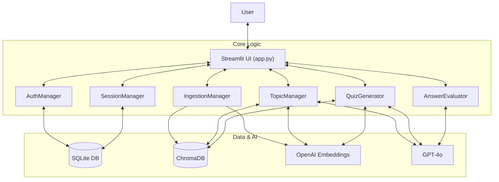
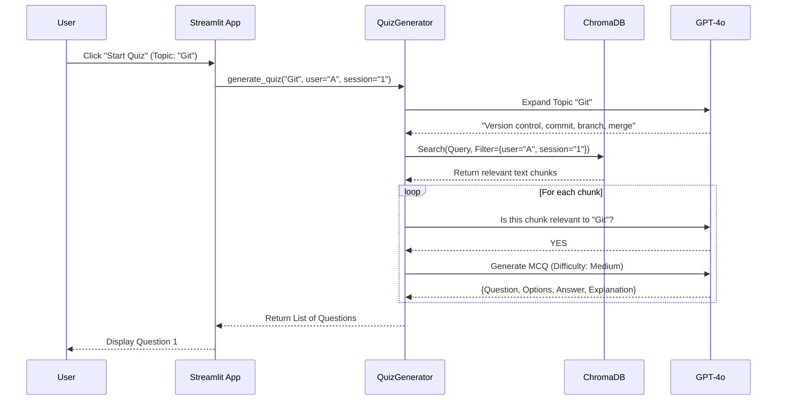

# Knowval AI Architecture & Data Flow

This document outlines the high-level architecture and detailed data flow of the Knowval AI application.

## High-Level Architecture

The application follows a modular, object-oriented design with a Streamlit frontend and a Python backend powered by LangChain, ChromaDB, and OpenAI.

## Detailed Data Flow

### 1. Authentication & Session Start
1.  **User** enters credentials or clicks "Login with Google".
2.  **`AuthManager`** verifies against `users.db` or Google OAuth.
3.  On success, **`SessionManager`** creates or loads a session in `sessions.db`.
4.  **`app.py`** stores `username` and `current_session_id` in Streamlit's `session_state`.

### 2. Document Ingestion
1.  **User** uploads a file (PDF, TXT, etc.).
2.  **`IngestionManager`** loads the file and splits it into chunks.
3.  **`IngestionManager`** generates embeddings for each chunk using OpenAI.
4.  **`IngestionManager`** stores chunks in **ChromaDB**, tagging them with metadata:
    *   `user_id`: For user isolation.
    *   `session_id`: For session isolation.

### 3. Topic Discovery (Multilevel Mode)
1.  **User** clicks "Discover Topics".
2.  **`TopicManager`** queries **ChromaDB** for structural keywords (e.g., "Introduction", "Chapter").
    *   *Filter*: `WHERE user_id = X AND session_id = Y`
3.  **`TopicManager`** sends the retrieved text to **GPT-4o** with a prompt to extract a syllabus.
4.  **`TopicManager`** returns a list of topics (e.g., "Git Basics", "Branching").

### 4. Quiz Generation
1.  **User** selects a topic and difficulty.
2.  **`QuizGenerator`** expands the topic into a search query using **GPT-4o**.
3.  **`QuizGenerator`** performs a **Max Marginal Relevance (MMR)** search in **ChromaDB**.
    *   *Filter*: `WHERE user_id = X AND session_id = Y`
4.  **`QuizGenerator`** validates each chunk's relevance using **GPT-4o**.
5.  **`QuizGenerator`** generates an MCQ for each valid chunk using **GPT-4o**.
6.  **`app.py`** displays the questions.

### 5. Answer Evaluation
1.  **User** selects an option and clicks "Submit".
2.  **`app.py`** compares the selected option with the stored `correct_answer`.
3.  **`app.py`** displays the pre-generated explanation.
    *   *Note*: Real-time LLM evaluation (`AnswerEvaluator`) is available but currently the app uses the pre-generated explanation for speed.

## Sequence Diagram: Quiz Generation Flow

